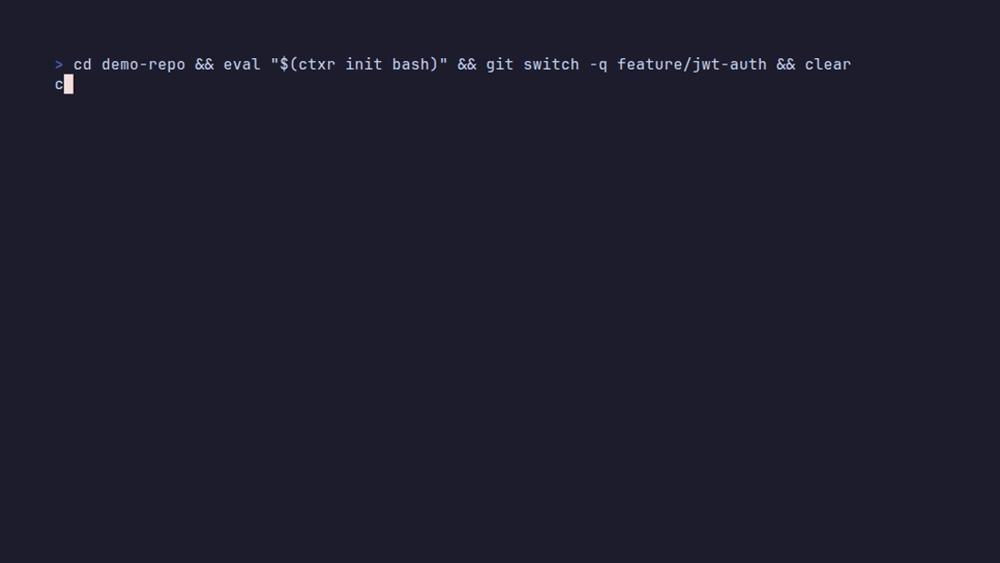

<div align="center">

# ContextResume

**Switch branches without losing your train of thought.**

`ctxr` freezes what you were doing, what broke, and what comes next.<br>
It hands it back the moment you return, to you or to Claude Code.

[](https://www.npmjs.com/package/context-resume)
[](https://github.com/yigitbozyaka/ContextResume/actions/workflows/ci.yml)
[](https://nodejs.org)
[](./LICENSE)
[](./docs/claude-code.md)



</div>

<br>

## Why

Every branch switch throws away the state that matters most: your intent, the
test that was failing, the thing you were about to try. Regaining that depth
of focus takes about 23 minutes on average.<sup>[1](#references)</sup>

`git stash` keeps the diff. Your terminal history keeps the commands. Nothing
keeps the *story*. ContextResume does, locally, with no model required.

<br>

## What you get

<table>
<tr>
<td width="50%" valign="top">

**A resume card on every branch switch**<br>
What you were doing, the last failing command with the parsed error
location, and a concrete next step.

**"While you were away"**<br>
How far `main` moved and which of your files it touched, before you hit a
conflict.

**One-key actions**<br>
Rerun the failing test, hand off to Claude Code, or inspect the diff since
the snapshot.

</td>
<td width="50%" valign="top">

**Shared memory with Claude Code**<br>
A plugin injects the branch context at session start and snapshots every
turn. An MCP server does the same for Claude Desktop and any other client.

**Optional AI summaries**<br>
`claude -p` or a local Ollama model turn raw signals into one line of intent.
The heuristic fallback always works.

**Morning standup in one command**<br>
`ctxr standup` lists every branch you touched across every repo.

</td>
</tr>
</table>

<br>

## Quick start

```bash
npm i -g context-resume
```

Hook your shell once. The hook is pure shell: it logs each command's exit code
and calls Node only when your branch changes.

```bash
# zsh  (~/.zshrc)
eval "$(ctxr init zsh)"

# bash (~/.bashrc)
eval "$(ctxr init bash)"
```

```powershell
# PowerShell ($PROFILE)
Invoke-Expression (& ctxr init pwsh | Out-String)
```

Then work as usual:

```bash
ctxr run pnpm test tests/auth.test.ts      # captures the failure for the card
ctxr pause "refactoring token refresh"     # optional note, in your words
git switch main                            # ...review a PR, fix a hotfix...
git switch feature/jwt-auth                # the card appears
```

<details>
<summary><b>The card, up close</b></summary>

```
╭──────────────────────────────────────────────────────────────╮
│  ContextResume -- feature/jwt-auth (demo-repo)               │
│  Last active: Thursday 17:45 (2 days ago)                    │
│                                                              │
│  WHAT YOU WERE DOING                                         │
│  Refactoring the token refresh flow in the JWT auth service. │
│  3 files changed: src/auth.ts, src/token.ts, tests/auth.ts   │
│                                                              │
│  LAST FAILING COMMAND                                        │
│  pnpm test tests/auth.test.ts (exit code 1)                  │
│  TokenExpiredError: jwt expired (tests/auth.test.ts:42)      │
│                                                              │
│  NEXT STEP                                                   │
│  Add a 30s clock tolerance at auth.ts:42 and rerun.          │
│                                                              │
│  WHILE YOU WERE AWAY                                         │
│  main gained 4 commits. 1 overlapping file (src/auth.ts),    │
│  possible conflicts.                                         │
╰──────────────────────────────────────────────────────────────╯
  Next
  > Rerun pnpm test tests/auth.test.ts
    Hand off to Claude Code
    Show what changed since the snapshot
    Quit
```

</details>

<br>

## Claude Code

ContextResume treats Claude Code as a second developer who shares your memory.

```
/plugin marketplace add yigitbozyaka/ContextResume
/plugin install context-resume@context-resume
```

| Piece | What it does |
|---|---|
| **SessionStart hook** | Injects the current branch's snapshot into every new session. |
| **Stop / PreCompact hooks** | Snapshot the branch after each turn and before compaction, so a closed terminal loses nothing. |
| **`/context-resume:ctxr` skill** | Lets Claude save a note in its own words and hand off context. |
| **Handoff** | Pick "Hand off to Claude Code" on the card, or `ctxr handoff` for markdown you can paste anywhere. |
| **MCP server** | `claude mcp add context-resume -- ctxr mcp` exposes `get_context`, `list_snapshots`, `save_snapshot`. |

Full details in [docs/claude-code.md](./docs/claude-code.md).

<br>

## Commands

| Command | Description |
|---|---|
| `ctxr pause [note]` | Freeze the current branch's context, with an optional note. |
| `ctxr resume [branch]` | Show the resume card. `--format markdown\|json` for machines. |
| `ctxr run <cmd>` | Run a command and keep the tail of its output for the card. |
| `ctxr diff` | Commits and working-tree changes since the snapshot. |
| `ctxr list` | Every saved branch in this repo (`--all` for every repo). |
| `ctxr standup [--since 24h]` | Recent activity across every repo and branch. |
| `ctxr handoff` | The snapshot as markdown for a PR, a teammate, or an agent. |
| `ctxr mcp` | Stdio MCP server for Claude Code, Claude Desktop, and friends. |
| `ctxr init <bash\|zsh\|pwsh>` | Print the shell hook. |

<br>

## AI summaries

The card works without any model. When the Claude Code CLI or a local
[Ollama](https://ollama.com) server is available, a manual `ctxr pause` or
`ctxr resume` upgrades the summary to a real sentence of intent, the blocking
error, and a next step. The automatic hook never waits on a model.

<details>
<summary><b>Configuration</b></summary>

| Variable | Effect |
|---|---|
| `CTXR_BRAIN=claude\|ollama\|heuristic` | Pin one summarizer. Default order: claude, ollama, heuristic. |
| `CTXR_BRAIN_TIMEOUT=30000` | Per-brain timeout in milliseconds. |
| `CTXR_CLAUDE_MODEL=haiku` | Model passed to `claude -p`. |
| `CTXR_OLLAMA_HOST`, `CTXR_OLLAMA_MODEL` | Ollama server and model. |
| `CTXR_NO_AUTO=1` | Keep logging, skip the automatic card on branch change. |
| `CTXR_DEBUG=1` | Explain why a summarizer was skipped. |

Pass `--no-ai` to `pause` or `resume` to skip models for one call.

</details>

<br>

## How it works

```
 shell prompt hook ──▶ .git/ctxr-log.tsv        (exit codes, pure shell)
        │
        └─ branch changed? ──▶ ctxr pause ──▶ ~/.context-resume/repos/<repo>/<branch>/
                                   │              ▲
                     git sensor ───┤              │ ctxr resume, plugin hook, MCP
                     terminal log ─┤              │
                     brain ────────┘   snapshot ──┘
```

Shell history files carry no exit codes and git has no pre-checkout hook, so
the prompt hook is the one place both signals exist. The design and the
decisions behind it are in [docs/architecture.md](./docs/architecture.md)
and [docs/adr](./docs/adr).

<br>

## Privacy

Everything stays under `~/.context-resume` and your repo's `.git` directory.
Nothing leaves your machine unless you opt into the `claude` or `ollama`
brain. Snapshots are scrubbed for common secret shapes (cloud keys, GitHub
tokens, JWTs, `KEY=` style assignments) before they touch disk. See
[SECURITY.md](./SECURITY.md).

<br>

## Built with Claude Code

ContextResume is developed with Claude Code and gives back a plugin, a skill,
and an MCP server so Claude Code sessions can read and write your context.
Every commit carries the co-author trailer.

## Contributing

The easiest first contribution is a test-runner parser: drop a real failing
output into `tests/fixtures/`, add a matcher in `src/sensors/testParser.ts`,
assert file, line and message in one test. Mocha, RSpec, dotnet test,
Gradle/Maven and PHPUnit are open as
[good first issues](https://github.com/yigitbozyaka/ContextResume/issues?q=is%3Aissue+is%3Aopen+label%3A%22good+first+issue%22).
Shell hooks, a Homebrew formula and a Slack standup format are up for grabs too.

Setup, conventions and the release flow are in [CONTRIBUTING.md](./CONTRIBUTING.md);
what is planned is in [docs/roadmap.md](./docs/roadmap.md).

## References

1. Gloria Mark, Daniela Gudith, Ulrich Klocke. *The Cost of Interrupted Work:
   More Speed and Stress.* CHI 2008.

## License

MIT © Yiğit Bozyaka
